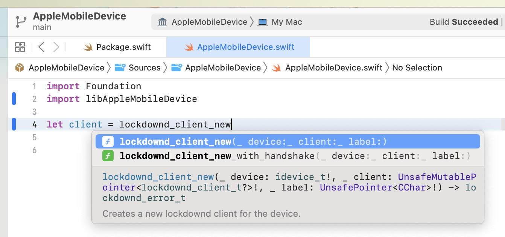

# Apple Mobile Device

Wrapper for Swift users to call libimobiledevice. Static linking with helpful functions, drop in and play. Support any Mac with arm64 or x86_64 arch.

## LICENSE

Same license as upstream project libimobiledevices, see [LICENSE](./LICENSE) for more details.

**If you use this library, AppleMobileDevice, you need to follow the license instructions of any used projects on your own listed below as there are static linked.**

- libimobiledevice
- libimobiledevice-glue
- libusbmuxd
- libplist
- openssl

The license inside this project only applies to my work.

---

Copyright © 2023 Lakr Aream. All Rights Reserved.

